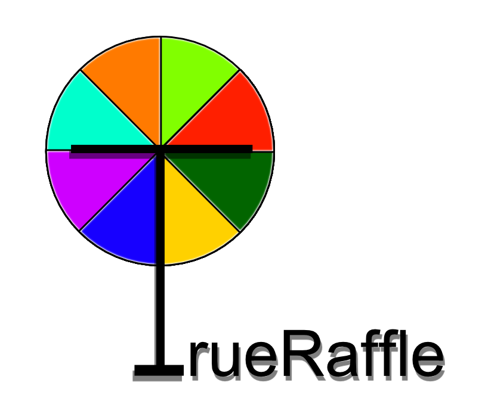
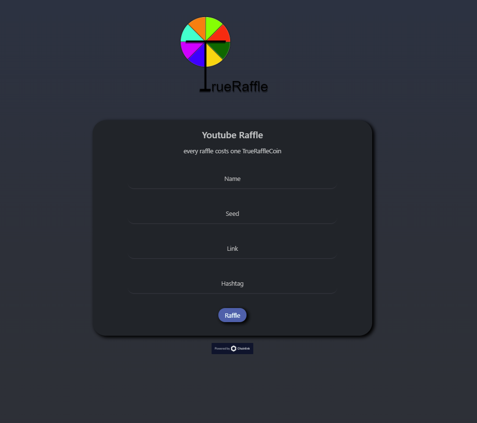
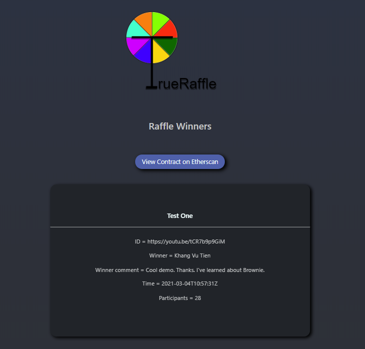
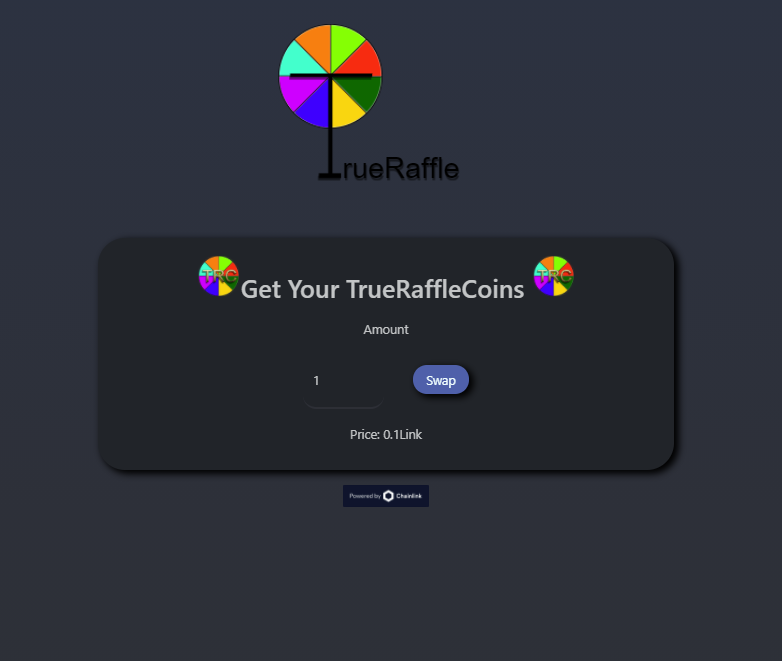

# TrueRaffle

### The Idea
A dapp which uses Chanlink VRF to make cryptographically secure random raffles making them trustless.
The goal is to use it with comments from Social Media (e.g. Youtube, Instagram) or just participation with Metamask.
The winner is saved on chain and verifiable by the Smartcontract.

### How to get it working
1. clone repository
2. run npm intstall in main directory
3. (optional) if you want to launch the smartcontracts yourself create an .env File matching the .env.example and migrate them to kovan
4. go into the app directory
5. run npm install
6. if you want to make request to Youtube you need to get an Youtube Api key and create an .env File in app matching it´s .env.example
7. run npm start

Note : Your Metamask should be connected to the kovan testnet going to localhost:Port/Testing you can make an Raffle with presaved comments without needing the Youtube Api key

### How it works

